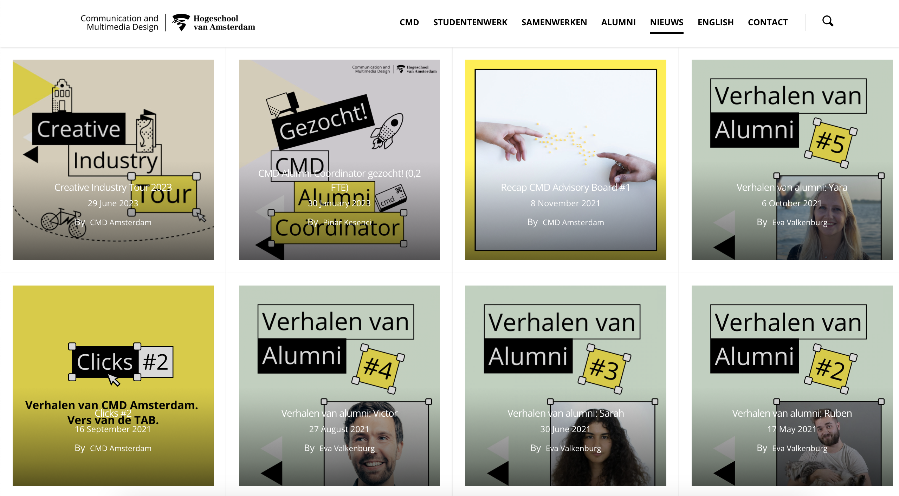
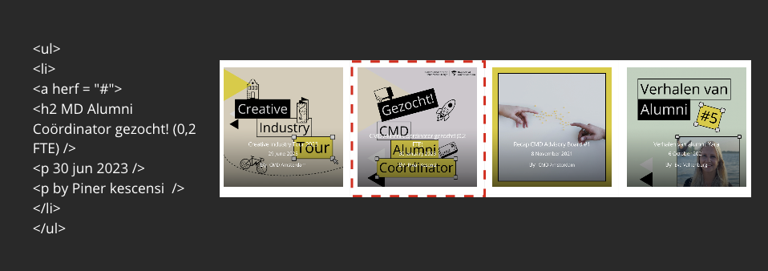

# Procesverslag
Markdown is een simpele manier om HTML te schrijven.  
Markdown cheat cheet: [Hulp bij het schrijven van Markdown](https://github.com/adam-p/markdown-here/wiki/Markdown-Cheatsheet).

Nb. De standaardstructuur en de spartaanse opmaak van de README.md zijn helemaal prima. Het gaat om de inhoud van je procesverslag. Besteedt de tijd voor pracht en praal aan je website.

Nb. Door *open* toe te voegen aan een *details* element kun je deze standaard open zetten. Fijn om dat steeds voor de relevante stuk(ken) te doen.

## Jij

  
uitwerken voor kick-off werkgroep

  ### Auteur:
Safa Mohalaia
  #### Je startniveau:
  rood / blauw

  #### Je focus:
  responsive
 

## Je website

  
uitwerken voor kick-off werkgroep

  ### Je opdracht:
 https://cmd-amsterdam.nl/ 
 Ons CMD website namaken 

  #### Screenshot(s) van de eerste pagina (small screen): 
  Home Pagina 
  

  #### Screenshot(s) van de tweede pagina (small screen):
  NEWS pagina
  
 

## Toegankelijkheidstest 1/2 (week 1)

  
uitwerken na test in 2e werkgroep

  ### Bevindingen
 De voice-over zet de toon met een heldere en gestructureerde presentatie, waarin de informatie volgens een logische volgorde wordt gepresenteerd. Hij benoemt nauwkeurig alle koppen, maar er is wel sprake van een herhaling bij het begin van elke nieuwe sectie, wat mogelijk voor enige verwarring kan zorgen.

Een positief aspect is dat alle links op de pagina duidelijk worden voorgelezen, inclusief een beschrijving dat het om een link gaat. Dit verbetert de begrijpelijkheid voor de luisteraar. Helaas blijken de foto's op de pagina niet leesbaar te zijn, en er ontbreekt beschrijvende tekst voor deze afbeeldingen. Op dit moment wordt alleen de tekst op de foto voorgelezen, wat de volledige context van de afbeeldingen kan beperken.

Desondanks is de gesproken tekst als geheel goed verstaanbaar en eenvoudig te begrijpen. De links op de pagina zijn correct gestructureerd en goed toegankelijk voor gebruikers van screenreaders, waardoor de navigatie soepel verloopt. Tot slot verdient het vermelding dat alle knoppen op een heldere manier worden voorgelezen als links, wat bijdraagt aan de gebruiksvriendelijkheid van de pagina voor mensen met visuele beperkingen."

Het contrast is zorgvuldig gecontroleerd en over het algemeen goed bevonden tijdens de tests. Er zijn effectieve kleurcombinaties gebruikt voor achtergronden en tekst, zoals zwart/wit, zwart/grijs en rood/geel. Bij het uitvoeren van een kleurencontrastcheck bij Siege Media, bleken alle kleuren over het algemeen goed leesbaar te zijn, met uitzondering van rood/geel. Deze combinatie vertoonde iets minder contrast dan de andere kleurcombinaties. Het gebruik van rood/geel is bovendien beperkt tot slechts twee woorden op de hele pagina, wat mogelijk bijdraagt aan de minder duidelijke leesbaarheid. 

Bij de kleurenblindheidstest in Chrome werden alle opties grondig getest. Over het algemeen bleken alle tests positief, met uitzondering van de blurred vision-test, waarbij de tekst niet gemakkelijk te lezen was. Ook bij de reductie van het contrast waren de resultaten positief, en alle tekst bleek goed leesbaar. Op de website zelf bleek dat alle kleuren, zelfs zonder het gebruik van blauw, rood of groen, goed leesbaar waren. Het enige aandachtspunt is de blurred vision-test, waarbij de leesbaarheid van de tekst kan worden verbeterd voor gebruikers met dit type kleurenblindheid

## Breakdownschets (week 1)

  
uitwerken na afloop 3e werkgroep

  ### de hele pagina: 
  

  ### dynamisch deel (bijv menu): 
  

  ### wellicht nog een dynamisch deel (bijv filter): 
  

## Voortgang 1 (week 2)

  
uitwerken voor 1e voortgang

  ### Stand van zaken
  hier dit ging goed & dit was lastig (neem ook screenshots op van delen van je website en code)

  ### Agenda voor meeting
  samen met je groepje opstellen

  | student 1      | student 2          | student 3    | student 4        |
  | ---            | ---                | ---          | ---              |
  | dit bespreken  | en dit             | en ik dit    | en dan ik dat    |
  | en dat ook nog | dit als er tijd is | nog een punt | dit wil ik zeker |
  | ...            | ...                | ...          | ...              |

  ### Verslag van meeting
  hier na afloop snel de uitkomsten van de meeting vastleggen

  - punt 1
  - punt 2
  - nog een punt
  - ...

## Voortgang 2 (week 3)

  
uitwerken voor 2e voortgang

  ### Stand van zaken
  hier dit ging goed & dit was lastig (neem ook screenshots op van delen van je website en code)

  ### Agenda voor meeting
  samen met je groepje opstellen

  | student 1      | student 2          | student 3    | student 4        |
  | ---            | ---                | ---          | ---              |
  | dit bespreken  | en dit             | en ik dit    | en dan ik dat    |
  | en dat ook nog | dit als er tijd is | nog een punt | dit wil ik zeker |
  | ...            | ...                | ...          | ...              |

  ### Verslag van meeting
  hier na afloop snel de uitkomsten van de meeting vastleggen

  - punt 1
  - punt 2
  - nog een punt
- ...

## Toegankelijkheidstest 2/2 (week 4)

  
uitwerken na test in 9e werkgroep

  ### Bevindingen
  Lijst met je bevindingen die in de test naar voren kwamen (geef ook aan wat er verbeterd is):

## Voortgang 3 (week 4)

  
uitwerken voor 3e voortgang

  ### Stand van zaken
  hier dit ging goed & dit was lastig (neem ook screenshots op van delen van je website en code)

  ### Agenda voor meeting
  samen met je groepje opstellen

  | student 1      | student 2          | student 3    | student 4        |
  | ---            | ---                | ---          | ---              |
  | dit bespreken  | en dit             | en ik dit    | en dan ik dat    |
  | en dat ook nog | dit als er tijd is | nog een punt | dit wil ik zeker |
  | ...            | ...                | ...          | ...              |

  ### Verslag van meeting
  hier na afloop snel de uitkomsten van de meeting vastleggen

  - punt 1
  - punt 2
  - nog een punt
  - ...

## Eindgesprek (week 5)

  
uitwerken voor eindgesprek

  ### Je uitkomst - karakteristiek screenshots:
  

  ### Dit ging goed/Heb ik geleerd: 
  Korte omschrijving met plaatjes

  

  ### Dit was lastig/Is niet gelukt:
  Korte omschrijving met plaatjes

  

## Bronnenlijst

  
continu bijhouden terwijl je werkt

  Nb. Wees specifiek ('css-tricks' als bron is bijv. niet specifiek genoeg). 
  Nb. ChatGpT en andere AI horen er ook bij.
  Nb. Vermeld de bronnen ook in je code.

  1. bron 1
  2. bron 2
  3. ...

