# Procesverslag
Markdown is een simpele manier om HTML te schrijven.  
Markdown cheat cheet: [Hulp bij het schrijven van Markdown](https://github.com/adam-p/markdown-here/wiki/Markdown-Cheatsheet).

Nb. De standaardstructuur en de spartaanse opmaak van de README.md zijn helemaal prima. Het gaat om de inhoud van je procesverslag. Besteedt de tijd voor pracht en praal aan je website.

Nb. Door *open* toe te voegen aan een *details* element kun je deze standaard open zetten. Fijn om dat steeds voor de relevante stuk(ken) te doen.

## Jij

  
uitwerken voor kick-off werkgroep

  ### Auteur:
Safa Mohalaia
  #### Je startniveau:
  rood / blauw

  #### Je focus:
  responsive
 

## Je website

  
uitwerken voor kick-off werkgroep

  ### Je opdracht:
 https://cmd-amsterdam.nl/ 
 Ons CMD website namaken 

  #### Screenshot(s) van de eerste pagina (small screen): 
  Home Pagina  

  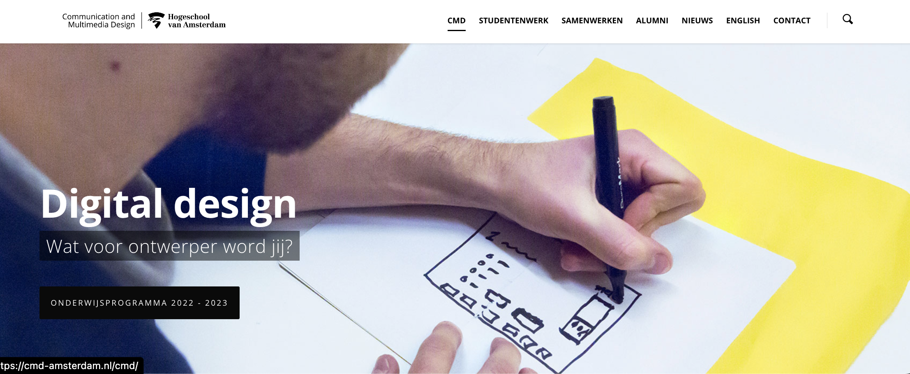

  #### Screenshot(s) van de tweede pagina (small screen):
 CMD pagina

  
 

## Toegankelijkheidstest 1/2 (week 1)

  
uitwerken na test in 2e werkgroep

  ### Bevindingen
 De voice-over zet de toon met een heldere en gestructureerde presentatie, waarin de informatie volgens een logische volgorde wordt gepresenteerd. Hij benoemt nauwkeurig alle koppen, maar er is wel sprake van een herhaling bij het begin van elke nieuwe sectie, wat mogelijk voor enige verwarring kan zorgen.

Een positief aspect is dat alle links op de pagina duidelijk worden voorgelezen, inclusief een beschrijving dat het om een link gaat. Dit verbetert de begrijpelijkheid voor de luisteraar. Helaas blijken de foto's op de pagina niet leesbaar te zijn, en er ontbreekt beschrijvende tekst voor deze afbeeldingen. Op dit moment wordt alleen de tekst op de foto voorgelezen, wat de volledige context van de afbeeldingen kan beperken.

Desondanks is de gesproken tekst als geheel goed verstaanbaar en eenvoudig te begrijpen. De links op de pagina zijn correct gestructureerd en goed toegankelijk voor gebruikers van screenreaders, waardoor de navigatie soepel verloopt. Tot slot verdient het vermelding dat alle knoppen op een heldere manier worden voorgelezen als links, wat bijdraagt aan de gebruiksvriendelijkheid van de pagina voor mensen met visuele beperkingen."

Het contrast is zorgvuldig gecontroleerd en over het algemeen goed bevonden tijdens de tests. Er zijn effectieve kleurcombinaties gebruikt voor achtergronden en tekst, zoals zwart/wit, zwart/grijs en rood/geel. Bij het uitvoeren van een kleurencontrastcheck bij Siege Media, bleken alle kleuren over het algemeen goed leesbaar te zijn, met uitzondering van rood/geel. Deze combinatie vertoonde iets minder contrast dan de andere kleurcombinaties. Het gebruik van rood/geel is bovendien beperkt tot slechts twee woorden op de hele pagina, wat mogelijk bijdraagt aan de minder duidelijke leesbaarheid. 

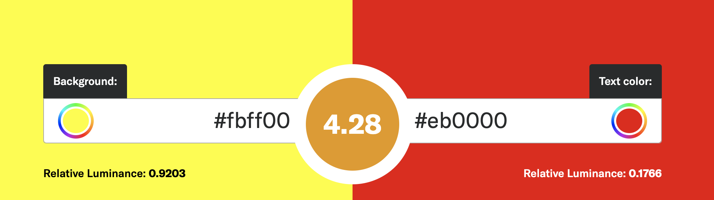

Bij de kleurenblindheidstest in Chrome werden alle opties grondig getest. Over het algemeen bleken alle tests positief, met uitzondering van de blurred vision-test, waarbij de tekst niet gemakkelijk te lezen was. Ook bij de reductie van het contrast waren de resultaten positief, en alle tekst bleek goed leesbaar. Op de website zelf bleek dat alle kleuren, zelfs zonder het gebruik van blauw, rood of groen, goed leesbaar waren. Het enige aandachtspunt is de blurred vision-test, waarbij de leesbaarheid van de tekst kan worden verbeterd voor gebruikers met dit type kleurenblindheid

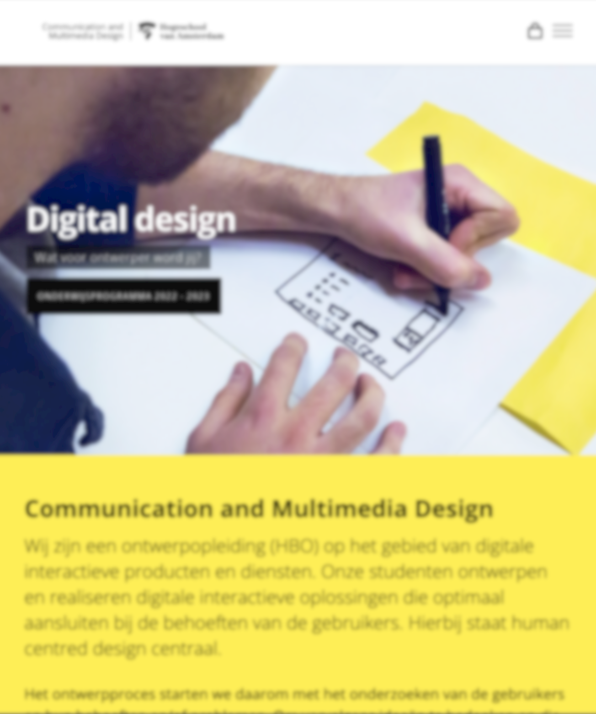

## Breakdownschets (week 1)

  
uitwerken na afloop 3e werkgroep

  ### de hele pagina: 
  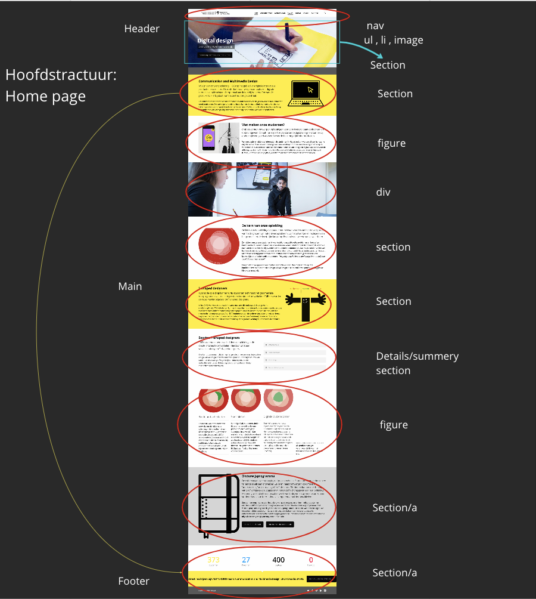

  ### dynamisch deel (bijv menu): 
  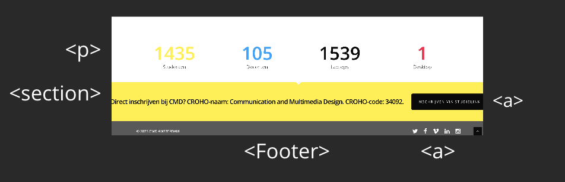

  ### wellicht nog een dynamisch deel (bijv filter): 
  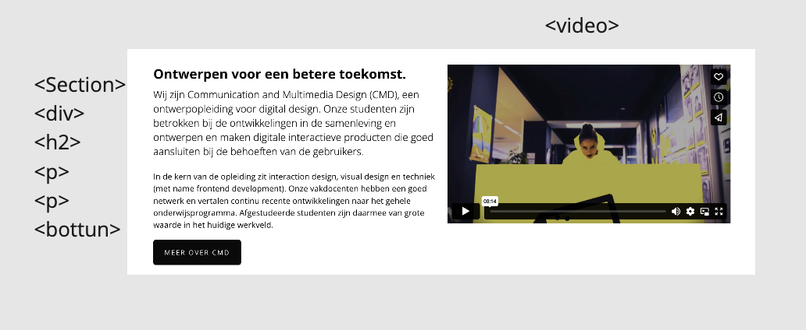

## Voortgang 1 (week 2)

  
uitwerken voor 1e voortgang

  ### Stand van zaken

Deze week ben ik begonnen met het website maken , ik ben nog alleen in de basis van de website om op te bouwen . heb ik een html pagina gedaan en voor css heb ik alleen de header nagemaakt. ik vind nog moeilijk om alle css selectors te weten en gebruiken daarom ga ik volgende week meer op css werken.

js ik laat het als laatste, ik wil eerts clean code hebben voor html css.

  ### Agenda voor meeting
  samen met je groepje opstellen

  | Safa           | Daan               | Red          | Chris            |
  | ---            | ---                | ---          | ---              |
  | css selectors  | Foto schalen per format             | Gif/Filmpje Responsive maken	   |  animated sliders |
  |Beeld maatriaal van site downloaden| | | scroll animaties|
  | ...            | ...                | ...          | ...              |

  ### Verslag van meeting
  hier na afloop snel de uitkomsten van de meeting vastleggen

  - tools gebruiken om alle details van de website nemen "foto's/font"
  - Nl ipv en
  - js voor foto's in de pagina gebruiken 
  - kijken welke pagina is handiger om als tweede te namaken

## Voortgang 2 (week 3)

  
uitwerken voor 2e voortgang

  ### Stand van zaken
  Ging goed: ik heb html pagina goed afgemaakt en ook begin css , de header en de footer en een section wel afgemaakt maar wat is lastig ging : ik heb erg moeite met css selectores 
  ik heb 2 of 3 classes gebruikt en die wil ik verbeteren.

  ### Agenda voor meeting
  samen met je groepje opstellen

  | Safa     | Daan          | red     |  chris     |
  | ---            | ---                | ---          | ---              |
  | over div's vragen  | felx box 
  inconsistenties             |Keyframes animatie | geen vragen   |geen vragen
  |code controleren | Wanneer grid | css code herhaling voorkomen|  |
  | ...            | ...                | ...          | ...              |

  ### Verslag van meeting
  hier na afloop snel de uitkomsten van de meeting vastleggen

  - Mag ik alleen een class gebruik met goed uitleggen waarom heb ik die gebruikt 
  - Style binnen html mag ik helemaal niet
  

## Toegankelijkheidstest 2/2 (week 4)

  
uitwerken na test in 9e werkgroep

  ### Bevindingen
 Ik heb mijn website voor voice-over voor het eerst opgezet en wil nu graag mijn bevindingen delen:

1- Headers en links zijn volledig leesbaar.
2- De tekst volledig correct is gelezen.
3- Er lijkt echter een knop te ontbreken omdat deze niet correct is geschreven in de HTML.

Bij Check formulier:
Het grootste deel van de vragen is goed en heb ik al afgehandeld. Echter, ik werk nog aan enkele zaken, zoals het oplossen van het horizontale scrollen. Daarnaast moet ik ook opletten op het gebruik van meerdere h1-tags op één pagina

## Voortgang 3 (week 4)

  
uitwerken voor 3e voortgang

  ### Stand van zaken
Ik heb de gehele HTML- en CSS-pagina voltooid en ervoor gezorgd dat alles responsive is op mijn website. Het hamburgermenu heb ik aanvankelijk in CSS gemaakt, maar ik ben van plan om het opnieuw te implementeren in JavaScript. Ik ben ook gestart met de tweede pagina, maar ben nog bezig met de afronding ervan.

  ### Agenda voor meeting
  samen met je groepje opstellen

  |Safa     | Daan          | Chris  | Red     |
  | ---            | ---                | ---          | ---              |
  | Vraag over een deel van mijn 
  pagina als die in css moet of js  | Slideshow/card slider           |Geen vragen   |   |
  | als ik een animatie moet doen | | |  |
  |Header/footer apart css          | ...                | ...          | ...              |

  ### Verslag van meeting
  hier na afloop snel de uitkomsten van de meeting vastleggen

  - Ik hoef niet om de menu in js maken ipv css , mag gwn in css blijven
  - ik moet nog micro interaction doen in js
  - ik mag wel alleen 2 css pagina , hoef het niet 3 
  

## Eindgesprek (week 5)

  
uitwerken voor eindgesprek

  ### Je uitkomst - karakteristiek screenshots:
   Het onderdeel waar ik het meest aan heb gewerkt en tijd aan heb besteed, was het hamburgermenu. Ik ben zeer tevreden met het resultaat; het was zeker geen eenvoudige taak om het te creëren, maar uiteindelijk is het gelukt. Ik moest een klasse gebruiken om de neststructuren te maken, aangezien ik veel CSS-selectors moest toepassen en al andere directe selectoren had gebruik. 

  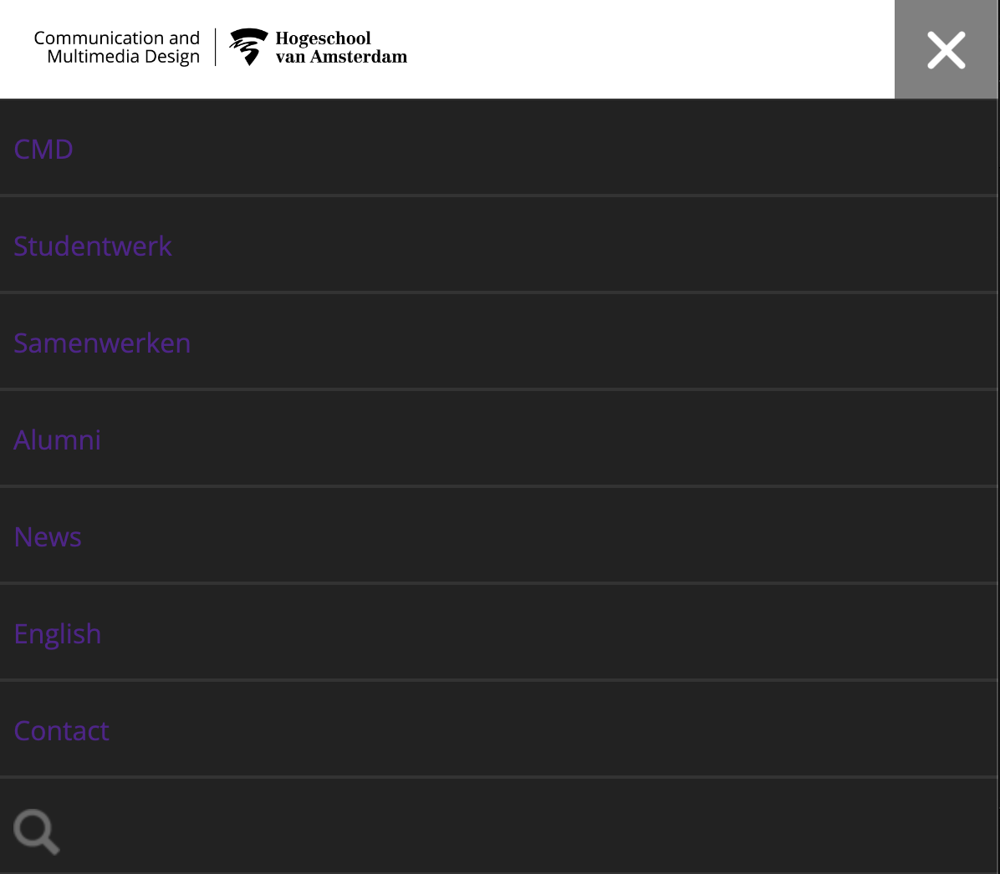

  Ik ben bijzonder tevreden over een ander aspect, namelijk de micro-interactie voor de foto's op de homepage die ik heb ontwikkeld. Ik heb alles in JavaScript geïmplementeerd en heb verschillende codes en benaderingen uitgeprobeerd. Uiteindelijk is het me gelukt om aan alle eisen van het vak te voldoen

  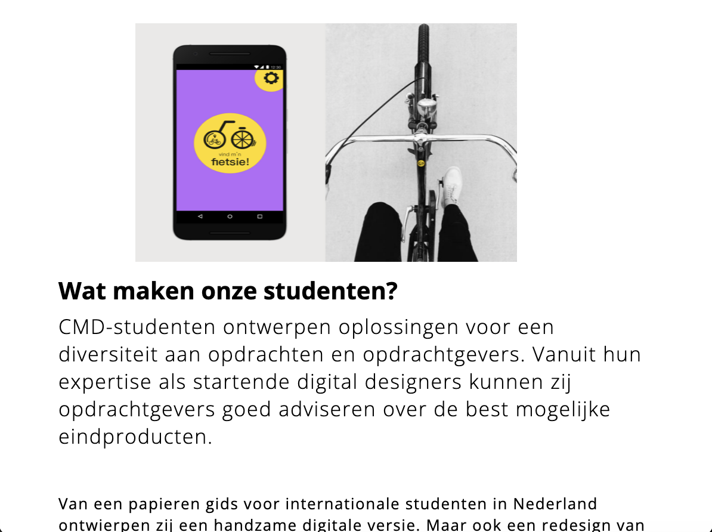

  Voor het eerst heb ik twee video's op de pagina geplaatst, waarbij ik de structuur van de pagina heb weten te behouden.

   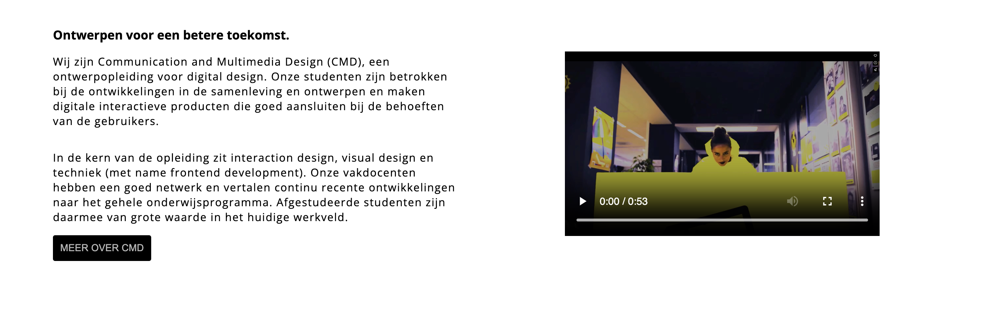

  ### Dit ging goed/Heb ik geleerd: 
  Ik heb eigenlijk ontzettend veel geleerd tijdens dit blok, maar een van de meest waardevolle aspecten was het leren creëren van een responsive website met behulp van '@media' queries. Ik vind persoonlijk dat dit het meest uitdagende onderdeel was van wat we dit blok hebben bestudeerd. Het vergt veel tijd en concentratie om dit goed te doen, maar het resultaat is het waard. Daarnaast heb ik kennis opgedaan over het implementeren van kleine animaties in CSS. Het gebruik van JavaScript voor micro-interacties op mijn website was ook nieuw voor mij en heeft mijn begrip van front-end ontwikkeling verdiept.

  Een andere waardevolle les was het werken met CSS-selectors zonder het gebruik van klassen of ID's, wat in het begin lastig was. Met veel oefening heb ik uiteindelijk geleerd hoe ik deze selectoren effectief kan gebruiken. Verder heb ik geleerd hoe ik mijn code beter kan begrijpen en efficiënter kan coderen. Dit omvatte niet alleen kennis van HTML-tags, maar ook inzicht in het optimaliseren van mijn code voor een betere leesbaarheid en onderhoud

  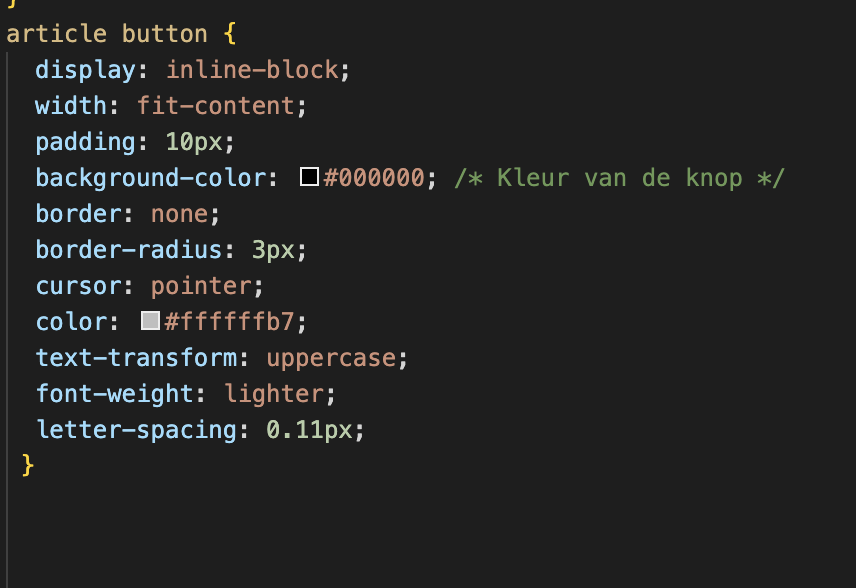

  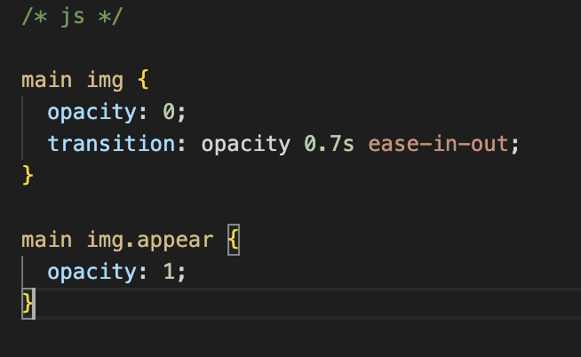

  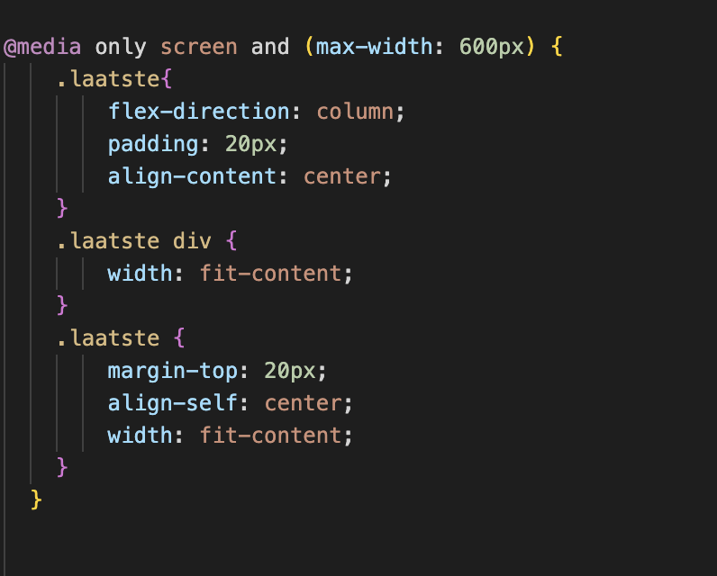

  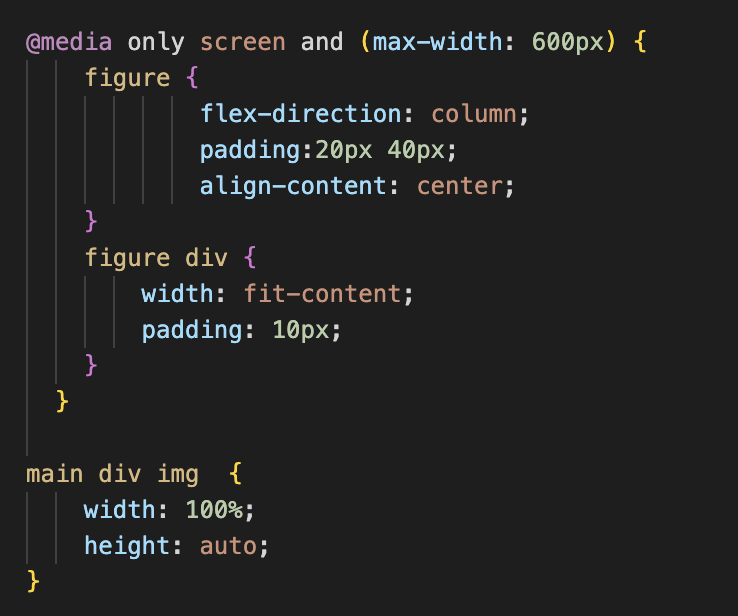

  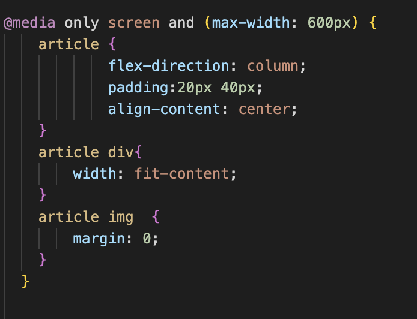

  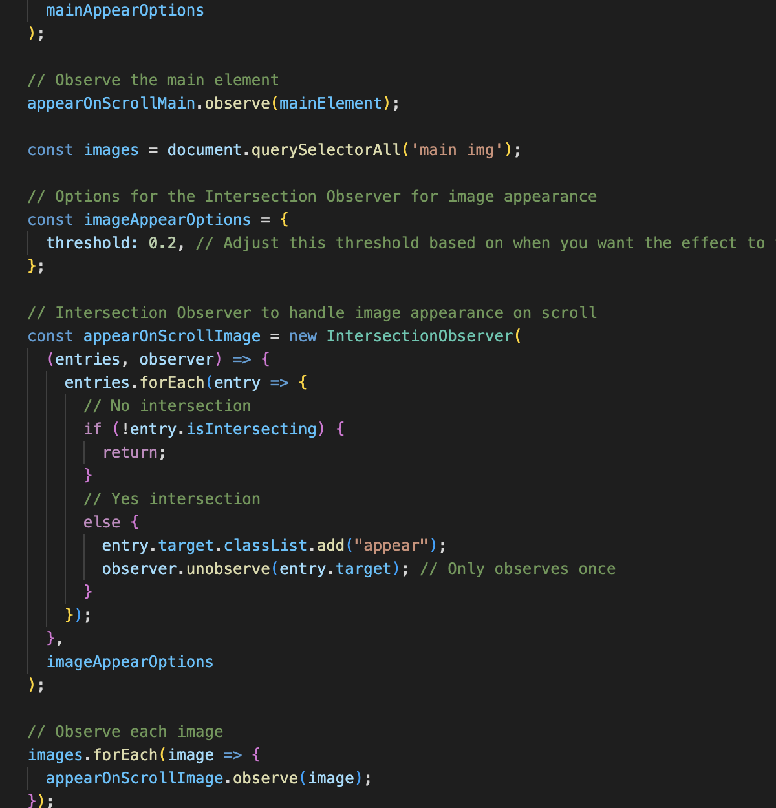

  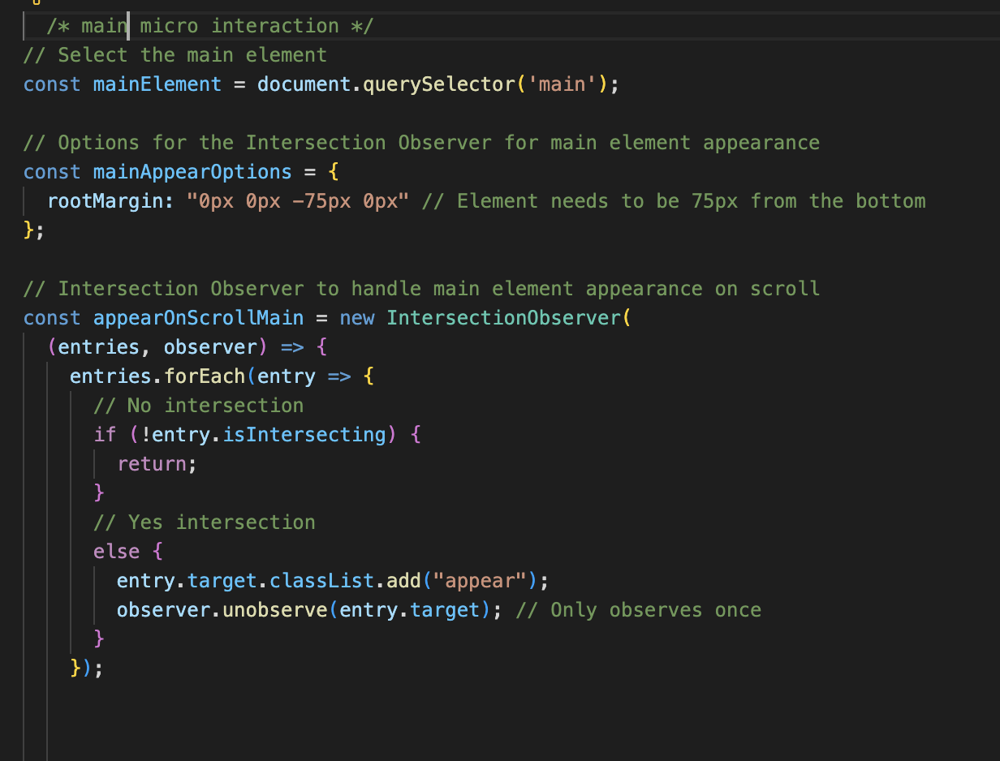

  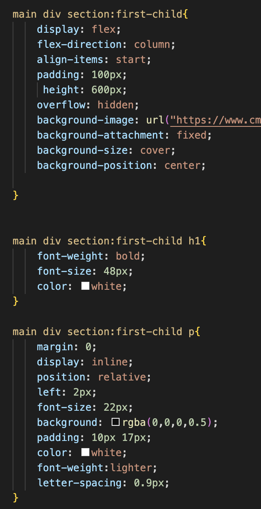

  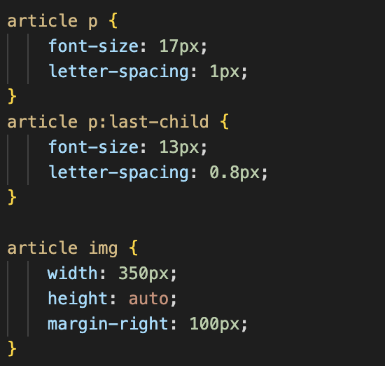
  

  ### Dit was lastig/Is niet gelukt:
 Ik heb aanzienlijke uitdagingen ondervonden bij het nauwkeurig repliceren van de structuur van de pagina. Bijvoorbeeld, het plaatsen van een video naast tekst met een header bleek lastig, omdat ik niet in staat was om het precies zoals de originele website te maken. Hoewel ik ze naast elkaar kreeg, waren er nog steeds enkele verschillen. Hetzelfde gold voor het gebruik van een afbeelding als achtergrond; hoewel ik erin slaagde om het als achtergrond in te stellen, had ik moeite om de grootte exact overeen te laten komen met die van de echte website. Het bleef helaas iets groter.

Een ander struikelblok was het laatste deel van de website, waarbij ik een nummer wilde laten aftellen wanneer de gebruiker naar beneden scrolde. Dit bleek ook een uitdaging te zijn en resulteerde niet helemaal in het gewenste effect. Als iemand die geobsedeerd is door details en strevend naar perfectie, merkte ik alle kleine verschillen en nuances op tussen mijn pagina en het origineel.

Ik ben blij met de resultaten die ik in korte tijd heb behaald, ondanks de uitdagingen. Het leer- en ontwikkelingsproces heeft mijn vaardigheden op een waardevolle manier verbeterd, en ik kijk tevreden terug op de vooruitgang die ik heb geboekt

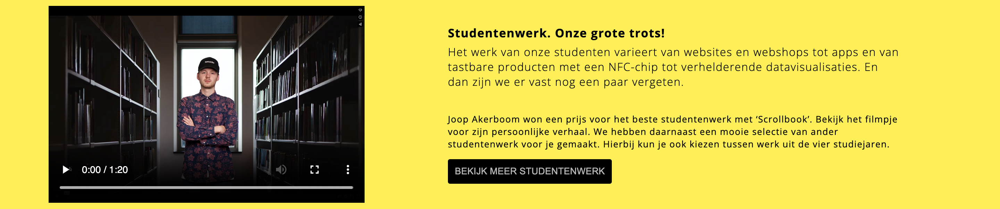

 

  

## Bronnenlijst

  
continu bijhouden terwijl je werkt

  Nb. Wees specifiek ('css-tricks' als bron is bijv. niet specifiek genoeg). 
  Nb. ChatGpT en andere AI horen er ook bij.
  Nb. Vermeld de bronnen ook in je code.

  1. chatgpt javasecript micro interactie 
  2. Responsive -> https://www.w3schools.com/css/css_rwd_mediaqueries.asp
      https://developer.mozilla.org/en-US/docs/Web/CSS/CSS_media_queries/Using_media_queries
      https://css-tricks.com/a-complete-guide-to-css-media-queries/
  3. Video Html -> https://www.w3schools.com/html/html5_video.asp
  4. Mobile Navigation Bar ->https://www.w3schools.com/howto/howto_js_mobile_navbar.asp
  5. Achtergrond in de css -> https://www.w3schools.com/cssref/pr_background-image.php
  6. css selectors -> https://developer.mozilla.org/en-US/docs/Web/CSS/CSS_selectors

